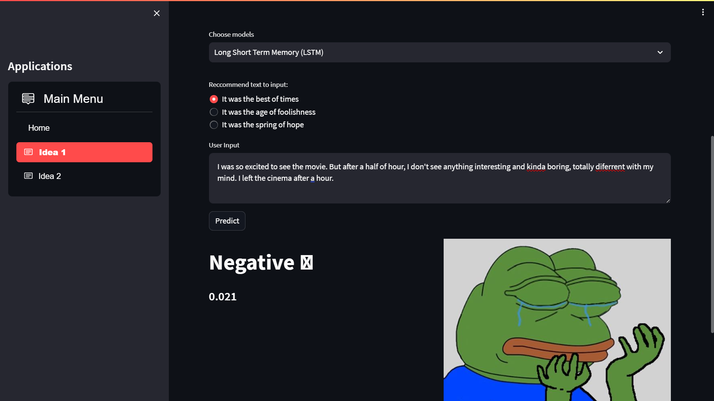
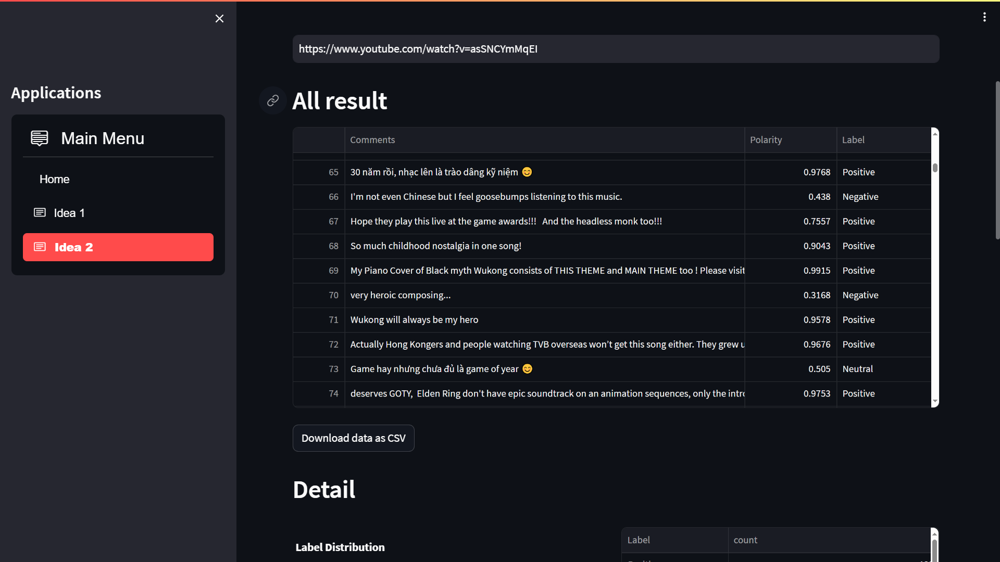
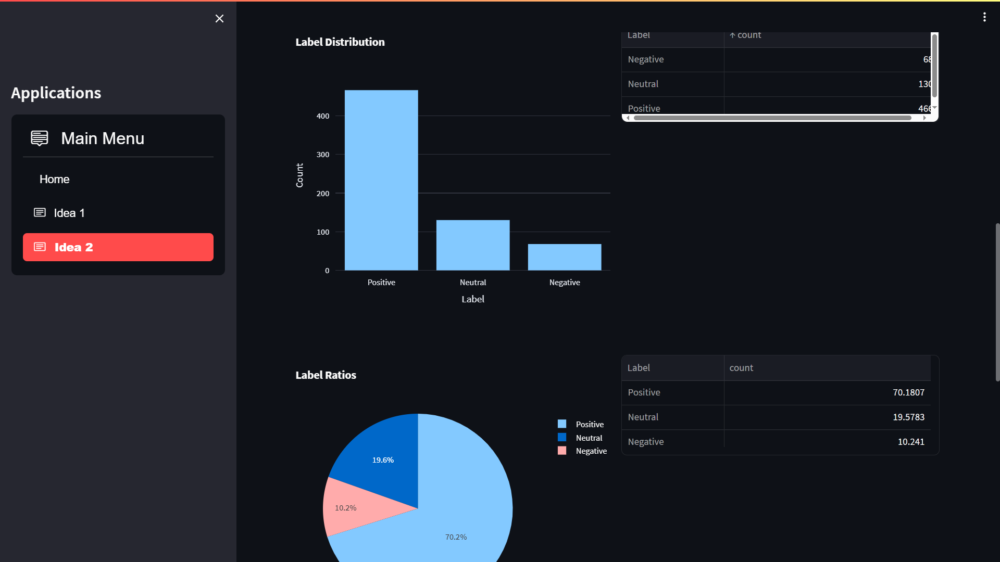

# Sentiment Analysis
Using some basic Deeplearning models and Glove Word Embedding trained on Imdb data to do Sentiment Analysis predict Amazon data and then implement a simple Streamlit app to predict comments from Youtube

Models used:
- Simple Neutral Network
- Long Short Term Memory
- Convolustional Neutral Network

Word Embedding: using `glove.6B.100d.txt` from Kaggle: [Stanford's GloVe 100d word embeddings](https://www.kaggle.com/datasets/danielwillgeorge/glove6b100dtxt)

## Environment 
- **Tensorflow version**: >2.0

To simply create virtual env supporting for CPU without AVX for Tensorflow, we can use Anaconda to help: 
```bash
conda create -n vir_env tensorflow=2.15.0 python=3.9
conda activate vir_env
pip install -r requirements.txt
```

## Display app
To use app, firstly generate `API_KEY` via Google Cloud Platform (GCP) in link: https://console.cloud.google.com/
(make sure you enable `YouTube Data API v3` already on GCP)

- You can find the detail instruction here: https://developers.google.com/youtube/v3/getting-started?hl=en


Then patse your API key in to file `env.template` and run the following command to create .env file:
```bash
cat env.template > .env
```
Finally, deploy **Streamlit app**:
```bash
cd app/
streamlit run main.py
```

Streamlit app interface:





## Finally
Feel free to use and try :))
